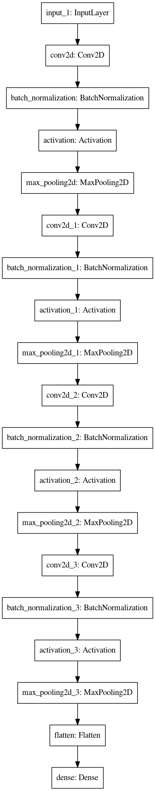
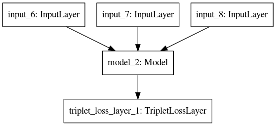

# RE-Identification of Person With Siamese Nets

This is a work of the doctoral course, AMMD2, from the Federal University of Amazonas, Institute of Informatics.

The purpose of this paper is to make an intelligent model that can re-identify people in different scenes.

To do this, we are using a TripletLoss Siamese network to transform images into Embeddings of size 64 and verify the similarity between two instances.

## Architecture

We are using a neural network with three inputs, each one is an image with shape (128, 64, 3). All them are passed to a commom CNN with following archtecture:



The output of each image is passed to a final Layer, TripleLossLayer, that compare the distance between anchor, positive and negative using euclidian distance. Then add this value in loss.

The Loss functino used is a dummy one that always return zero (0). The ground-truth is dummy too, because it is not used to compute the final Loss. In the following image the final archtecture is presented.




## Execution

To reproduce the experiments, make a clone of this repository in a machine with Python 3.6 and Conda. Then, execute the following command to create the conda environment necessary:

```
$ conda env create -f environment.yml --debug
$ jupyter-labs
```

So execute all cells on webpage that will open with jupyter-labs.


## Authors

* Everton Lima Aleixo

* João Batista Pereira Matos Júnior


